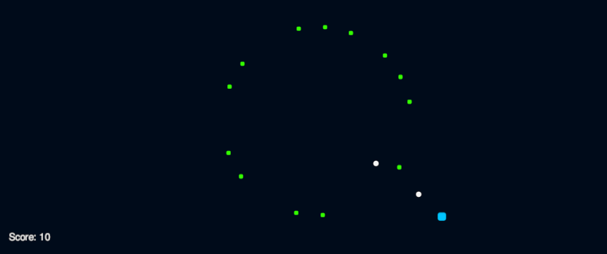

This was generated using chat-gpt. 

This relates to the source-code. The challenge was to not write a single line of code. 

Here are the prompts used:

1. write all the scripts needed to replicate the game gyruss in unity in c#.
1. add the ability of spawning bullets to the playercontroller.
1. make the enemies take damage, when they collide with a bullet
1. make the enemies move in a circle around a transform called center
1. set the center transform in the EnemyMovement class when an enemy is spawned
1. make the player rotate in a fixed radius around the center transform instead of moving it horizontally and vertically
1. make the bullets move from their spawn point to the center transform and set the center transform when they are spawned
1. rename bulletmovement to bulletcontroller and give me the whole code from playercontroller and bulletcontroller.

The scene setup, assigning scripts, creation of prefabs and assets was done manually. 

* White: Bullets
* Green: Enemies
* Cyan: Player

